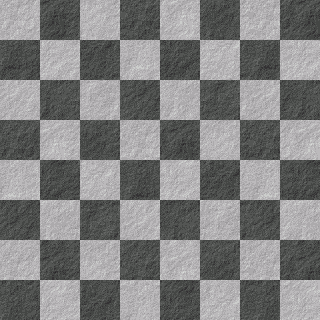
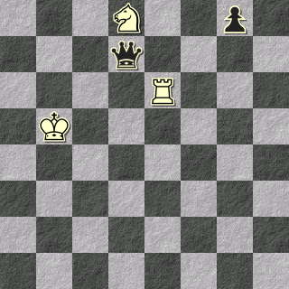

# 4. La Scacchiera

Il gioco si svolge attorno ad una scacchiera da scacchi. In questo capitolo spiegher; le varie mosse con degli esempi. Per rendere il più semplice possibile la rappresentazione delle mosse ogni diagramma sarà rappresentato con una immagine generata da un [software](https://www.jinchess.com/chessboard/composer/) e con la rispettiva notazione che elenca il contenuto di tutte le 64 caselle. Purtroppo non è una notazione ufficiale e non si può usare FEN perché il suddetto software cerca di validarlo e fallisce sempre perché guarda un po', questo non è davvero Scacchi. 

Esempio: una scacchiera vuota:

    ----------------------------------------------------------------

# 4.1. La scacchiera come misura dell'età di Morte (personaggio)

Il gioco inizia con la Regina Nera, che rappresenta Morte (personaggio) in una delle caselle della prima riga, e termina con la Regina Nera in una delle caselle dell'ultima riga.

Ogni volta che la Regina Nera passa alla riga successiva, che sia per via di una mossa di Vita o di una mossa di Morte, entra in una fase successiva della sua vita.

E' facile ad un colpo d'occhio capire quindi a che punto della vita di Morte, e quindi anche del gioco, siamo.

Esempio: vicino alla fine del gioco:

    ---N--p----q--------R----K--------------------------------------

In questa posizione la Regina Nera è alla settima riga, quindi la maggior parte della vita di Morte (personaggio) è alle sue spalle, e la fine del gioco è vicina.

E' interessante notare come questo non ci dica in realtà nulla sull'età effettiva di Morte (personaggio). Potrebbe avere 10 anni, ed avere avuto una vita incredibilmente breve ma intensa, oppure 90 anni.