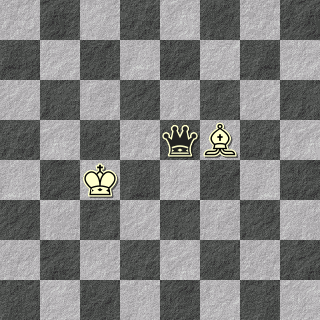
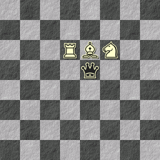
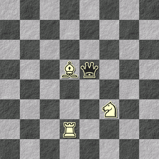

# 4. La Scacchiera

Il gioco si svolge attorno ad una scacchiera da scacchi. In questo capitolo spiegherò le varie mosse con degli esempi. Per rendere il più semplice possibile la rappresentazione delle mosse ogni diagramma sarà rappresentato con una immagine generata da un [software](https://www.jinchess.com/chessboard/composer/) e con la rispettiva notazione che elenca il contenuto di tutte le 64 caselle. Purtroppo non è una notazione ufficiale e non si può usare FEN perché il suddetto software cerca di validarlo e fallisce sempre perché guarda un po', questo non è davvero Scacchi. 

Esempio: una scacchiera vuota:

    ----------------------------------------------------------------

## 4.1. La scacchiera come misura dell'età di Morte (personaggio)

Il gioco inizia con la Regina Nera, che rappresenta Morte (personaggio) in una delle caselle della prima riga, e termina con la Regina Nera in una delle caselle dell'ultima riga.

Ogni volta che la Regina Nera passa alla riga successiva, che sia per via di una mossa di Vita o di una mossa di Morte, entra in una fase successiva della sua vita.

E' facile ad un colpo d'occhio capire quindi a che punto della vita di Morte, e quindi anche del gioco, siamo.

Esempio: vicino alla fine del gioco:

    ---N--p----q--------R----K--------------------------------------

In questa posizione la Regina Nera è alla settima riga, quindi la maggior parte della vita di Morte (personaggio) è alle sue spalle, e la fine del gioco è vicina.

E' interessante notare come questo non ci dica in realtà nulla sull'età effettiva di Morte (personaggio). Potrebbe avere 10 anni, ed avere avuto una vita incredibilmente breve ma intensa, oppure 90 anni.

### 4.1.1. Fasi della vita

Ci sono otto righe, che corrisponderanno a 8 fasi della vita di Morte (personaggio). 

Una fase non ha una durata specifica, e due fasi anche consecutive possono avere durate completamente diverse. 

Le fasi corrispondono a momenti narrativi, e non a semplici età.

> **Sbagliato**: 
> La fase in cui Morte ha 16 anni
> 
> **Giusto**: La fase in cui Morte sta andando alle superiori

### 4.1.2. Crescere

Quando la Regina Nera avanza in una riga successiva, sta *Crescendo*, cioè sta passando in una diversa fase della sua vita.

Questo può succedere per via di una mossa di Morte, o per una mossa di Vita.

Durante la descrizione della vignetta bisogna far capire come mai ci troviamo in una nuova fase della vita. Ci sono due metodi:

- Descrivere un grande cambiamento (cambio di scuola, nuovi amici, nuovi amori, pubertà)
- Descrivere un dettaglio stilistico (ciondoli, acconciature, vestiti)

Sono entrambi metodi validi, che vanno a dipingere Fasi molto diverse o poco diverse.

Possono anche essere combinati, anche se è un po' overkill.

> Esempi:
> Morte sta prendendo il bus per andare al liceo. E' il suo primo giorno
> Morte è a lezione come al solito. I suoi capelli però hanno le punte viola.
> Morte passeggia mano nella mano con Elodìè, la nuova ragazza in viaggio di scambio.

## 4.2. La scacchiera come misura delle relazioni

La scacchiera è anche una mappa delle relazioni. Più un pezzo è vicino alla Regina Nera, più quel personaggio è vicino ed ha influenza su Morte.

Non solo, la posizione dei pezzi bianchi nei confronti degli altri pezzi bianchi dice qualcosa sulla relazione tra quei due personaggi.

### 4.2.1. Influenza e vicinanza

    ----------------------------qB----K-----------------------------

In questa posizione la Regina Nera è più vicina all'Alfiere che al Re. Questo significa che l'Alfiere è una figura più presente nella vita di Morte (Personaggio) in questa fase della vita. Considerando il Potere del Re, tuttavia, hanno entrambi la possibilità di Tirare la Regina Nera.

### 4.2.2. Bloccare

    -------------------RBN------q-----------------------------------

In questa posizione la Regina Nera non può avanzare, e quindi non può Crescere. Ci possono essere varie interpretazioni di cosa questo significa. E' importante notare tuttavia che la Regina Nera può ancora muoversi lateralmente, o può Spingere via uno dei pezzi. 

E' abbastanza difficile che la Regina Nera venga tenuta imprigionata dai pezzi bianchi. Questo richiederebbe che tutti i giocatori di vita fossero interessati a mantenerla bloccata ed è abbastanza difficile immaginare quale situazione possa portare a tale scelta.

### 4.2.3. Inseguimento

La Regina Nera è sempre il centro della rete di relazioni. Mentre Morte cresce capita che alcuni personaggi rimangano indietro, allontanandosi da lei. Per alcuni inseguire Morte diventa più semplice, per altri se perdono l'occasione è finita.

    ---------------------------Bq----------------N-----R------------

In questa posizione il Cavallo è rimasto leggermente indietro. Tuttavia poiché si muove di due caselle è semplicissimo raggiungere la Regina Nera anche in un unica mossa.

La Torre invece è abbastanza condannata a essere sempre meno rilevante, a meno che almeno due giocatrici non siano determinate a farla riavvicinare a Morte.
