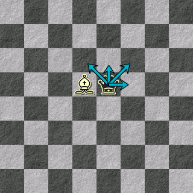
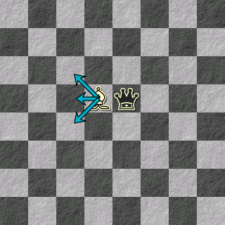
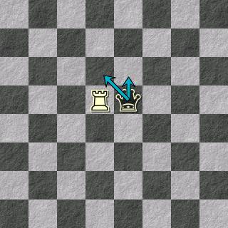
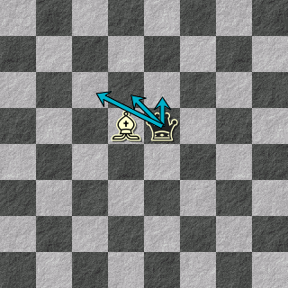
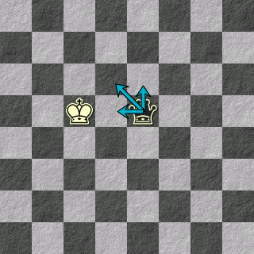

# 7. Mosse

Parliamo delle mosse. Una mossa in questo gioco consiste nello spostare un pezzo sulla scacchiera, secondo certi criteri, e raccontare una vignetta che illustri il cambiamento che è avvenuto sulla scacchiera.

## 7.1. Mosse di Morte

Morte ha a sua disposizione solo due mosse, che però possono dare il via a un sacco di diverse vignette diverse:

### 7.1.1. Muoversi

Morte può muovere la Regina Nera di una casella in ogni direzione che non sia indietro. La casella di arrivo deve essere libera, senza altri pezzi sopra. Non può uscire dalla scacchiera (non ci credo che l'ho dovuto specificare).

Esempio:

    ---------------------------bq-----------------------------------&a=e5d6%2Ce5e6%2Ce5f6%2Ce5f5

### 7.1.2. Spingere

Morte può muovere un Pezzo Bianco di una casella in ogni direzione che si allontani dalla Regina Nera, anche all'indietro. La casella di arrivo deve essere libera, senza altri pezzi sopra. No, neanche così si possono far uscire pezzi dalla scacchiera.

La distanza tra due pezzi si conta in maniera abbastanza intuitiva guardando le caselle che li separano. Diagonali, righe e colonne contano uguale.

La Torre ha il Potere speciale di non potere essere spinta.

    ---------------------------Bq-----------------------------------&a=d5c6%2Cd5c5%2Cd5c4

## 7.2. Mosse di Vita

Vita può fare molte più cose: introdurre pezzi, togliere pezzi, spostare pezzi. E' divertente fare Vita.

### 7.2.1. Introdurre

Piazza un nuovo pezzo bianco sulla scacchiera, dove vuoi, in una casella vuota. Sì, dentro la scacchiera. Andiamo, su.
Descrivi il personaggio sulla base della sua forma, che riporto qua:

- Alfiere. Una persona con degli ideali. 
- Cavallo. Una persona che non segue le regole. 
- Re. Una persona potente. 
- Torre. Una persona solida. 

### 7.2.2. Avvicinare

Muovi un pezzo di una casella in modo che sia più vicino alla Regina Nera. Come al solito, casella vuota, non uscire dalla scacchiera.
Nota che questo è l'unico movimento che puoi far fare ai pezzi Bianchi. Loro ronzano attorno a Morte, inseguendola nel suo cammino. Poetico.

### 7.2.3 Tirare

Questa mossa è un po' complicata. Praticamente se la Regina Nera è adiacente a un pezzo, puoi muoverla di una casella in modo che continui a rimanere adiacente. Ricorda che la Regina Nera non può mai indietreggiare e PERCHÈ CERCHI DI SPOSTARE I PEZZI FUORI DALLA SCACCHIERA, NON SI GIOCA COSÌ.

    ---------------------------Tq-----------------------------------&a=e5e6%2Ce5d6

L'alfiere ha la capacità speciale di muovere la Regina Nera di due caselle, ma sempre mantenendola adiacente a se stessa.

    ---------------------------Bq-----------------------------------&a=e5e6%2Ce5d6%2Ce5c6

Il re ha la capacità speciale di poter tirare da una distanza di due caselle, potendo anche avvicinare a sè la Regina Nera. Tuttavia può muoverla solo di una casella.

   --------------------------K-q-----------------------------------&a=e5e6%2Ce5d6%2Ce5d5

### 7.2.2 Rimuovere

OK, ecco, con questa mossa PUOI togliere un pezzo dalla scacchiera. Contenta adesso? Mamma mia.

Comunque, nella vignetta devi descrivere come mai spariscono dalla vita di Morte. Magari muoiono, o prendono un bus per andare in un altra regione.